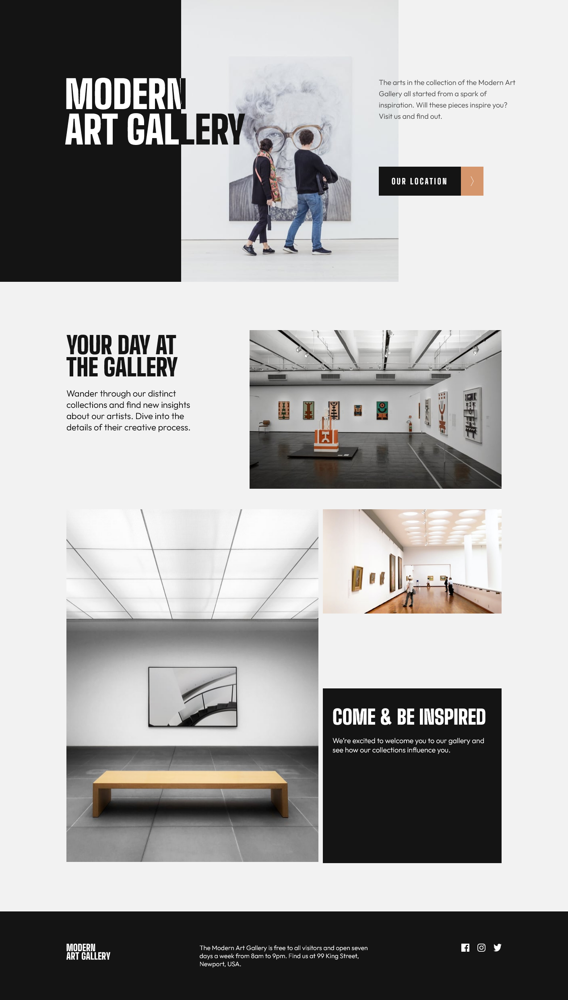

# Frontend Mentor - Art gallery website solution

This is a solution to the [Art gallery website challenge on Frontend Mentor](https://www.frontendmentor.io/challenges/art-gallery-website-yVdrZlxyA). Frontend Mentor challenges help you improve your coding skills by building realistic projects.

## Table of contents

- [Overview](#overview)
  - [Screenshot](#screenshot)
  - [Links](#links)
- [Author](#author)

## Overview

This is a simple 2 page website with 3 views, mobile, tablets and desktop, only html and css was used in process

### Screenshot

Too preview all views as png check out desing folder

### Links

[Click to view live site](https://gwynbleidd0014.github.io/art-gallery-website/)

## Author

Hello, I'm Ucha, you might know me as [gwynbleidd0014](https://github.com/gwynbleidd0014) on github
